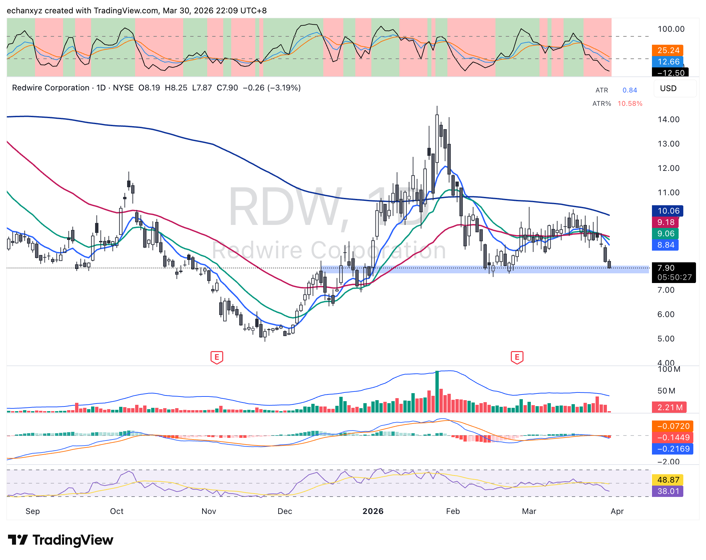
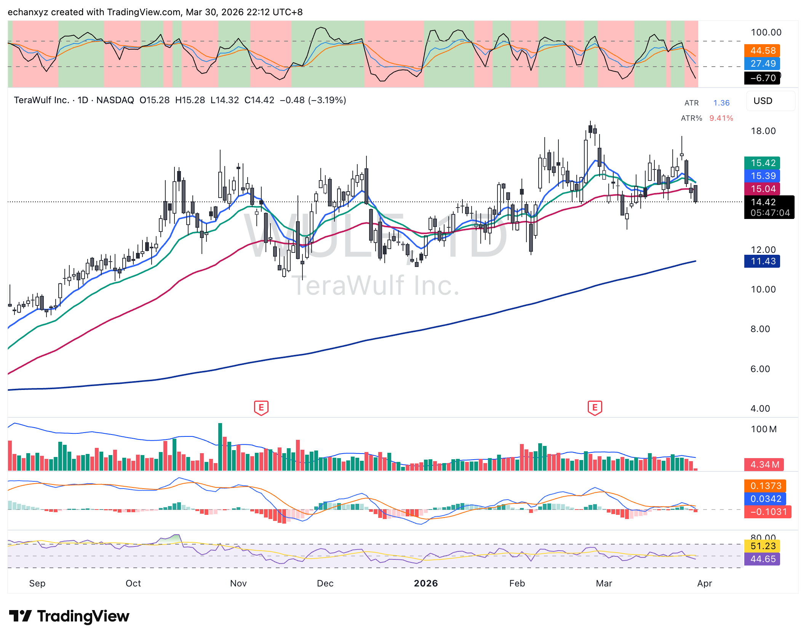
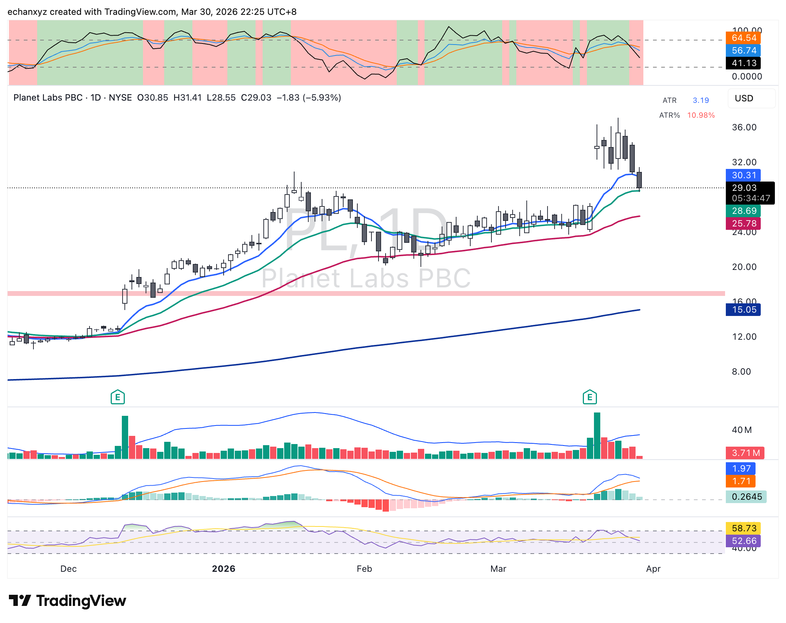

## 盤前觀察（HKT 13:38）

### 今日圖表

**NQ 日線（2026-03-30）**

**ES 日線（2026-03-30）**

---

### NQ（Nasdaq 100 E-mini）

- 早盤 gap down，開盤 O:23,189，最低 L:23,093，快速修復至 C:23,345（+0.07%）
- ATR: 534（2.29%）— 波動率偏高
- 現價接近 **2025年4月 Tariff Tension 支撐區**（約 23,000–24,000）
- 上方四條均線形成壓力：24,028–24,795
- 藍色長期上升趨勢線約在 22,000–22,500，為最後防線
- 底部動量指標約 41.33 — 接近超賣但未極端

### ES（S&P 500 E-mini）

- 同樣早盤 gap down 後修復至 C:6,417.50（+0.08%）
- 支撐區（藍色帶）約 6,230–6,350（2025年4月 Tariff 支撐）
- 上方均線阻力：6,566–6,765
- 底部指標約 37.31 — 接近超賣

---

## Capitulation 評估

### 支持上週五為恐慌低點的證據

- VIX 收盤突破 30（近 12 個月高位）
- $SPY Put Volume spike 破 800 萬（SubuTrade，歷史上接近底部）
- Put/Call Ratio 1.12
- 今早 NQ/ES gap down 後**快速修復** — 典型「假破位後吸籌」行為
- 兩大期指觸及 2025年4月 Tariff 支撐位並守住

### 尚未確認的因素

- 今晚美股正式開盤後是否能維持並站上均線
- 伊朗局勢未明朗（TACO 地緣風險持續）
- 需要成交量確認（縮量反彈 = 健康；高量拒絕 = 看跌）

### 初步判斷（低-中信心）

今早的 gap down + 快速回補是**積極訊號**，說明支撐位有實質買盤。但單日行為不足以確認 capitulation 已完成。今晚美股開盤後的**前 30 分鐘走勢**是關鍵觀察窗口：
- 若開盤繼續走高並站穩 → capitulation 假設增強
- 若開盤拉高後回落 → 繼續磨底，謹慎

---

## 盤前更新（HKT 20:13）

### 今晚重大事件風險

| 催化劑 | 評估 |
|--------|------|
| 鮑威爾講話 | 市場高度敏感，任何降息/鷹派措辭都會放大波動 |
| 本週非農（週五 4/4） | 就業數據直接影響 Fed 路徑預期 |
| 油價期貨突破 $100 | 美伊戰爭第五週，霍爾木茲壓力持續 |
| VIX 30.63 | 仍在高位，但未繼續上升 |

### Capitulation 評分板（截至 HKT 20:13）

| 指標 | 狀態 | 含義 |
|------|------|------|
| VIX | 30.63（高位但未繼續升） | 恐慌持續，未消散 |
| Put/Call spike | 上週五已觸發 | 底部訊號（歷史上 100% 正面 1 個月後） |
| 油價 $100 | 新突破，通脹壓力 | 壓制 Fed 降息空間 |
| 鮑威爾今晚 | 未知 | 最大催化劑 |
| NQ/ES 支撐 | 接近 2025 年 4 月 tariff support | 技術面支撐有效 |

**當前判斷（低信心）：** capitulation 可能已發生，但油價 $100 突破是新變數，可能推遲確認。等鮑威爾定調後再調整信心水平。

---

## 板塊輪動：太空/國防 & 加密基礎設施

### UFO（太空 ETF）— 技術圖表

**技術邏輯：**
- 跌破 50MA（~$44.39），有 following through 確認
- 跌破 $43.52 支撐區
- 板塊已從高位回落，獲利了結壓力大
- MACD 動能轉負（-0.2443），確認跌勢
- 近期成交量出現較大紅柱（派發）
- RSI 指標 43.09，跌入中性偏弱

**技術結論：** 三重確認（跌穿 50MA + 支撐破位 + following through）。$37 是下一個 200MA 支撐。

---

### RDW（Redwire Corp）— 技術圖表

**技術邏輯：**
- 跌破藍色支撐帶（$7.90–$8.20）
- 四條均線全在上方（10.06 / 9.18 / 9.06 / 8.84），強力壓頂
- MACD：-0.0720/-0.1449/-0.2169，三線全負，動能持續惡化
- RSI：48.87/38.01，跌入弱勢區
- 3月後縮量下跌，缺乏買盤
- 前高 ~$14（2026年2月），累計跌幅超 -40%
- 太空/國防板塊輪動結束

---

### WULF（TeraWulf — BTC 挖礦）— 技術圖表

**技術邏輯：**
- 跌破 ~$15 水平支撐，有 following through
- 四條均線全在上方（15.42/15.39/15.04/11.43）
- MACD 快線跌至負值（-0.1031），死叉形成
- RSI：51.23 → 44.65，動能轉空
- 今日大紅柱確認賣壓

---

### PL（Planet Labs）— 技術圖表

**技術邏輯：**
- 跌破 ~$30.31 水平支撐（20MA），有 following through 確認
- 前高 ~$36（3月初），加速下跌
- MACD：快線（1.97）死叉慢線（1.71），動能轉弱
- 成交量 3.71M 大紅柱，賣壓確認
- ATR 10.98%，高波動率板塊下跌
- UFO/RDW/WULF/PL 同步走弱，太空板塊整體結構性下跌

**核心觀察：** 太空/國防與加密基礎設施板塊輪動結束，資金明確撤出高位主題股。若要重新考慮入場，需等待價格站回 50MA 以上並有成交量確認。
