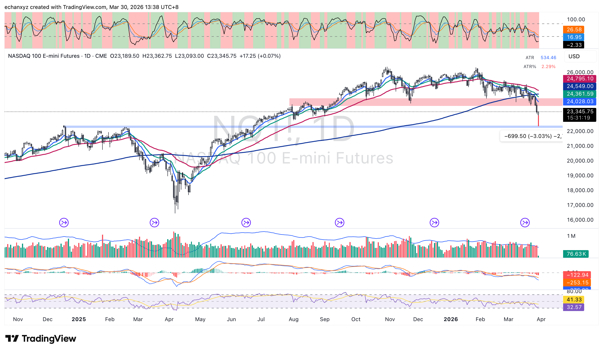
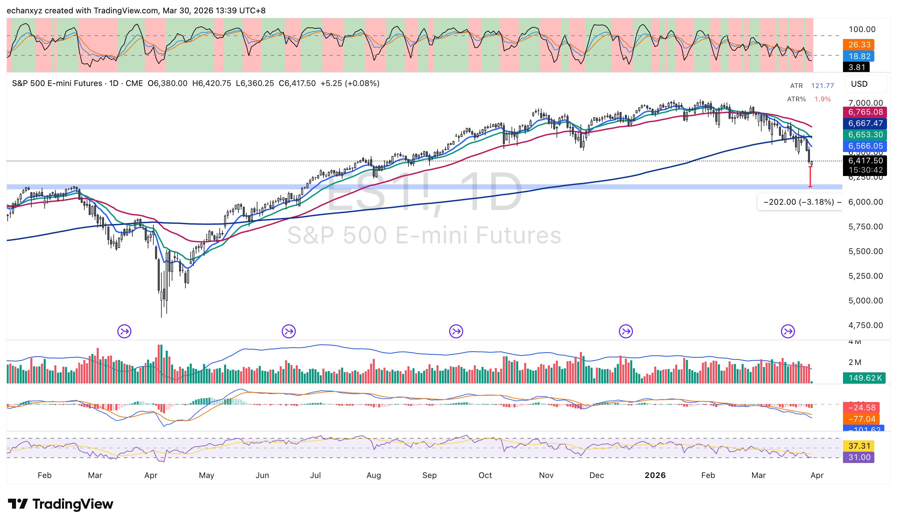

## 跳空低開觸及關稅支撐 — 投降式賣壓觀察

### NQ 與 ES：支撐區守住

週一早盤，NQ 和 ES 期貨大幅跳空低開，NQ 最低觸及 23,093，ES 逼近關鍵支撐帶。**最重要的觀察：兩大指數均在早盤修復跌幅** — 這種行為符合機構在支撐位承接的典型特徵。

**NQ 技術面：**
- 早盤低點 23,093，修復至 23,345（+0.07%）
- ATR: 534（2.29%）— 波動率仍處高位
- 關鍵支撐帶：23,000–24,000（2025年4月關稅衝擊支撐區，粉紅區域）
- 上方均線阻力：24,028–24,795（4條均線形成壓頂）
- 長期上升趨勢線：~22,000–22,500（最後結構性防線）
- 底部動量指標：~41.33 — 接近超賣但未極端

**ES 技術面：**
- 修復至 6,417.50（+0.08%）
- 支撐帶：6,230–6,350（2025年4月關稅支撐區）
- 均線阻力：6,566–6,765 壓頂
- 底部動量：~37.31 — 接近超賣

---

### 上週五是否已出現 Capitulation（投降式賣壓）？

**支持的證據：**
- VIX 收盤突破 30 — 近 12 個月高位
- $SPY Put 成交量 spike 破 800 萬股（SubuTrade 數據）— 歷史上接近底部
- Put/Call Ratio：1.12 — 極端恐慌讀數
- 週一跳空低開後快速回補 = 「假破位後吸籌」的典型行為
- 兩大指數守住 2025年4月關稅支撐區

**尚未確認的因素：**
- 伊朗局勢仍未明朗（TACO 風險）
- 需要成交量確認（縮量反彈才是健康底部）

**初步判斷（低-中信心）：** 跳空低開後快速修復是積極訊號，但單日行為不足以確認 capitulation。今晚美股開盤後 **30 分鐘的走勢**是關鍵觀察窗口。

---

### 今晚關鍵事件
- **鮑威爾講話** — 任何鷹/鴿措辭都會放大市場波動
- **原油期貨突破 $100** — 美伊戰爭第五週，霍爾木茲壓力持續
- **VIX：30.63** — 仍在高位，等待轉向訊號

### 今晚觀察清單
- NQ：能否守住 23,869（最近的均線）？
- ES：能否收復 6,566 阻力位？
- VIX：跌破 29 = 確認訊號
- 成交量：反彈縮量 = 健康
