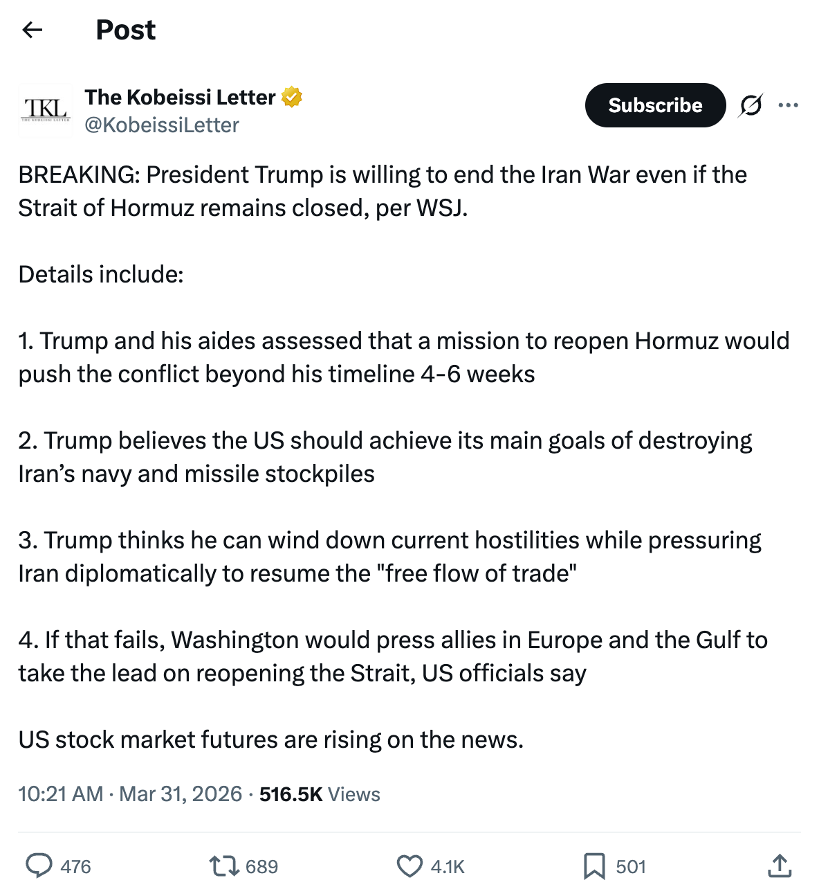
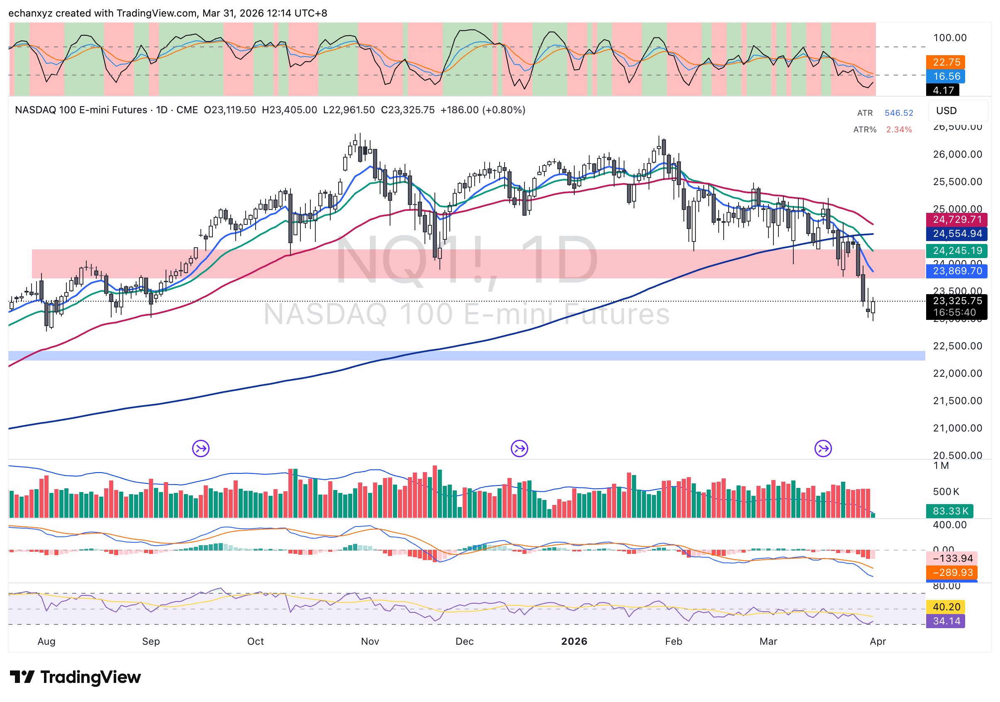
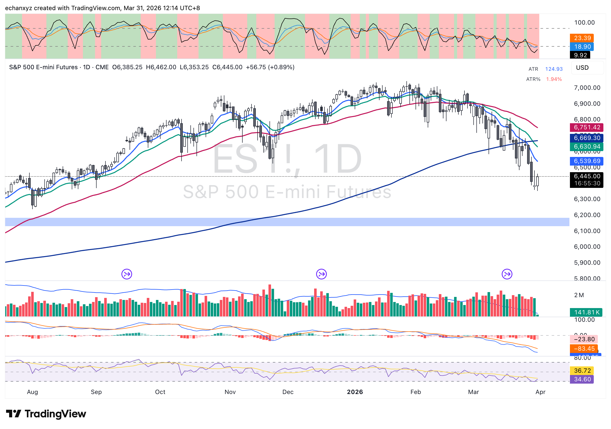
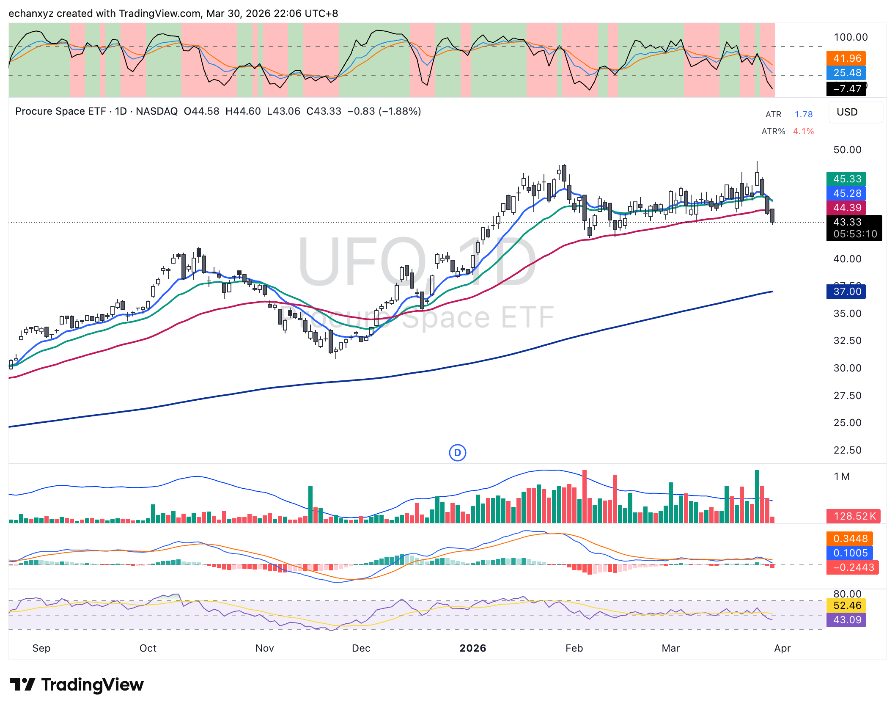

## TACO 訊號出現 — 伊朗談判消息帶動期貨拉升

### 重大消息：Trump 表態願意結束伊朗戰爭

來源：WSJ（Kobeissi Letter 轉述，約 ET 上午 10:21）：Trump 據報願意在霍爾木茲海峽仍未重開的情況下結束伊朗戰爭。要點：
1. Trump 認為霍爾木茲重開超出 4-6 週的時間線
2. 主要目標：摧毀伊朗海軍和導彈庫存
3. 考慮外交施壓伊朗，恢復「自由貿易流通」
4. 若失敗，將向歐洲和海灣盟友施壓帶頭重開海峽

**市場反應：NQ 期貨 +0.80%，ES 期貨 +0.89%。**

---

### NQ 夜盤技術分析（3月31日盤前）

- 現價：23,325.75（+186，+0.80%）
- 仍在粉紅色 2025年4月關稅支撐帶（~23,000–24,000）內
- 上方四條均線：23,977 / 24,270 / 24,569 / 24,722 — 首個關口：23,977
- CMF（量能指標）：-59/-295 — 仍為負，買盤尚未完全進場
- 動量指標：44/41 — 從超賣區回彈，上行空間充裕
- **今晚關鍵位：24,270（20MA）**

### ES 夜盤技術分析

- 現價：6,445（+56.75，+0.89%）
- 水平虛線支撐 ~6,566 已重新收回 — 有意義的技術突破
- 上方均線群：6,637 / 6,672 / 6,749 — 首個目標：6,637
- 動量：-6/-83，仍為負但快線明顯回升
- RSI：44/38 — 從深度超賣反彈

---

### 板塊輪動：太空/國防主題結束

週一太空/國防板塊出現結構性崩潰（UFO ETF 及相關標的）：

**UFO 技術面：**
- 跌破 50MA（~$44.39）— 趨勢反轉訊號
- 跌破 $43.52 水平支撐，有 following through 確認
- MACD 動能轉負（-0.2443）
- 成交量確認：放量紅柱（賣壓確認）

**解讀：** 太空/國防主題的板塊輪動窗口已關閉。資金正在撤出高位主題股，回流至優質標的。這與 WULF（比特幣挖礦）、RDW（太空製造）、PL（衛星影像）同日出現技術破位的現象一致 — 多個標的同步崩潰說明是板塊性輪動，而非個股事件。

---

### 宏觀判斷

**TACO 風險框架：**
歷史顯示 Trump 頻繁降級（"Trump Always Chickens Out"）。WSJ 報道符合這個模式。但需注意：
- 一條新聞 ≠ 結構性底部
- SPY/QQQ 技術面仍在創新低
- 成交量確認仍是關鍵

**今晚策略：** 等待正式開盤。盤前漲幅可能逆轉。正規交易時段的前 30 分鐘將決定此次 TACO 反彈是否有持續性。
