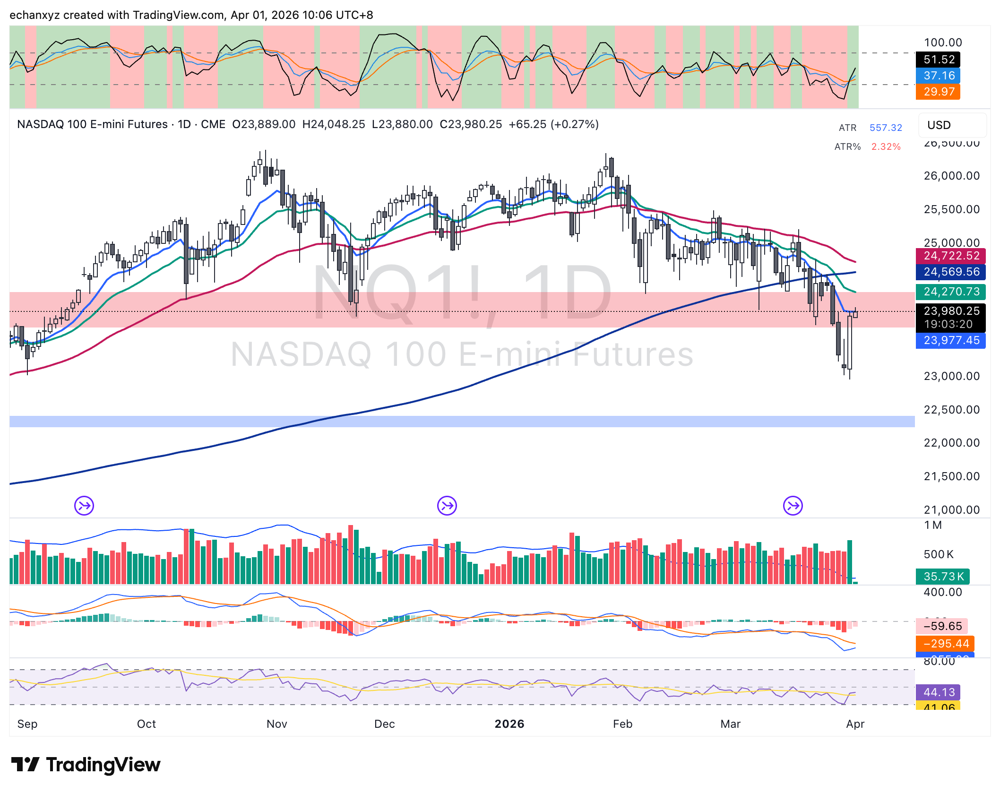
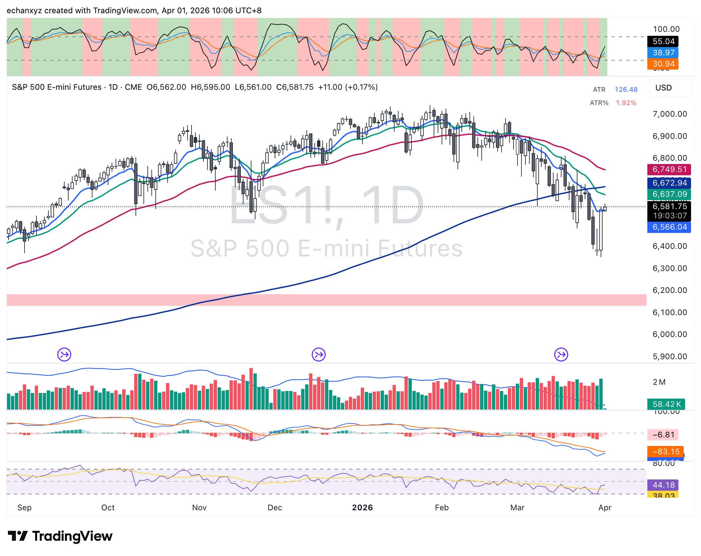
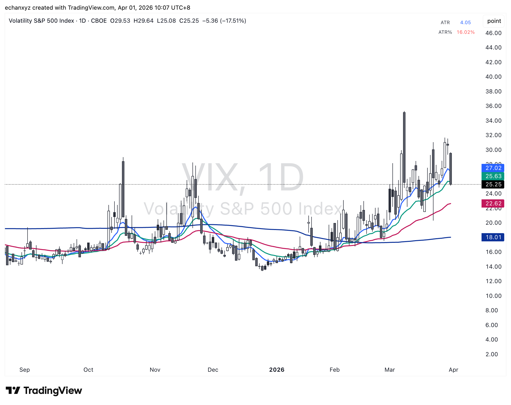
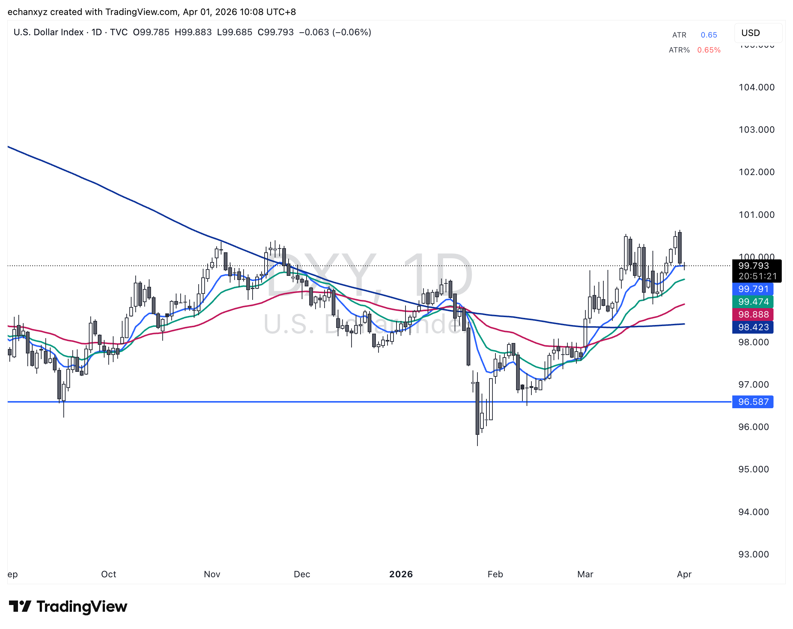
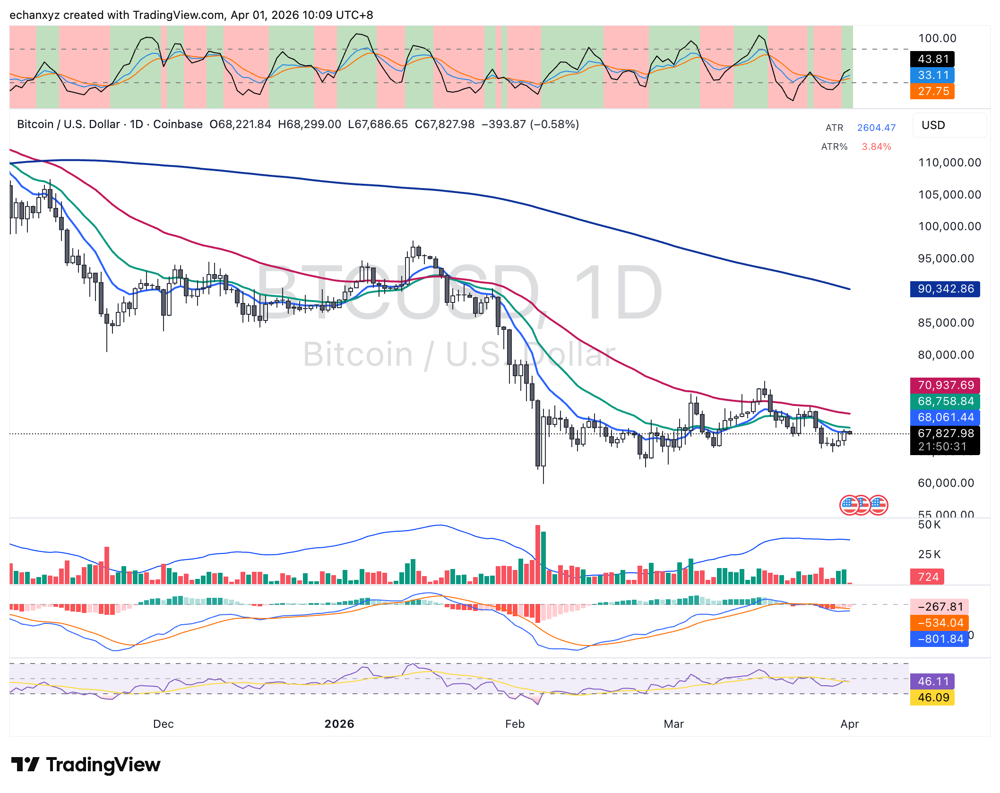
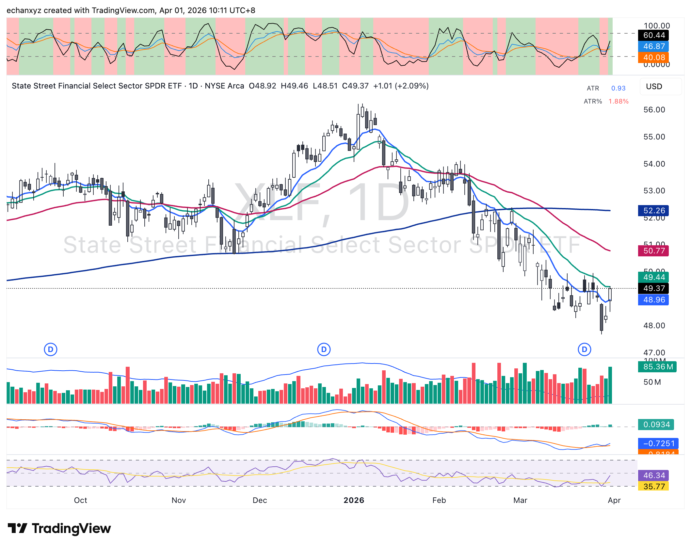

## 盤前宏觀圖表分析（HKT 10:06–10:11）

### 今日背景 — TACO 反彈日

昨日 TACO 訊號（Trump 透過 WSJ 釋放願意談判結束伊朗戰爭）帶動夜盤期貨大幅上漲。市場從 2025年4月 Tariff 支撐區強力反彈，網安板塊領漲。

---

### NQ — 強烈反轉訊號，等 Following Through

- 現價 C: 23,980（+65，+0.27%）
- **昨日 Hammer 蠟燭：** O:23,889 → L:23,880 → C:23,980 — 近乎完美錘形（低點接近開盤，收在高位）
- **收在粉紅 Tariff Support Band 上方**（~23,800–24,270），反彈力度強
- 上方阻力：四條均線 23,977 / 24,270 / 24,569 / 24,722，第一關是 23,977
- CMF（量能指標）：-59/-295，仍為負 — 買盤尚未完全進場
- RSI/動量：44/41，從超賣區向上，有上行空間
- **今晚關鍵：** 能否突破並守住 24,270（20MA）

---

### ES — 同步強反轉，接近均線群

- 現價 C: 6,581.75（+11，+0.17%）
- 昨日同樣出現 Hammer，從 6,400 低位強力反彈至 6,582
- **水平虛線支撐 ~6,566 剛好被收回**（技術上重要）
- 上方均線群：6,637 / 6,672 / 6,749，今晚目標先看 6,637
- 底部動量：-6/-83，仍為負但快線明顯回升
- RSI：44/38，從深度超賣反彈

---

### VIX — 關鍵性下跌，從 30+ 回落至 25.25，-17.5%

- 昨日：O:29.53 → C:25.25，**單日 -5.36（-17.51%）**
- 從 30+ 恐慌區回落至 25，是 capitulation 後的典型行為
- 均線仍上斜（20MA 25.63，50MA 22.62），高波動環境尚未完全結束
- **方向轉變明確：** 若今晚繼續跌破 25，capitulation 確認升至**高信心**

---

### DXY — 美元回落至 100 心理關口以下

- DXY 從 100.5 高點回落至 99.79（-0.06%）
- **100.00 同時是心理和技術關口**，目前在下方
- 均線仍在上升趨勢（98.42/98.88/99.47），但方向扁平化
- **對市場意義：** 美元走弱 → 有利成長股（科技/網安）估值提升

---

### BTC — 反彈力度不足，橫盤觀望

- 現價 $67,827（-0.58%），TACO 帶動的反彈後略回落
- 所有均線（68,061/68,758/70,937/90,342）均在上方壓頂
- MACD：-267/-534/-801，三線全負，動能持續弱
- 昨日 TACO 消息帶動反彈，但未能突破任何均線
- **結論：** BTC 短期下行趨勢未反轉，$64–65k 支撐位是觀察入場的關鍵區間
- 繼續等待，目前觀望

---

### XLF — 放量守住 10MA，正面訊號

- 現價 $49.37（+$1.01，+2.09%），今日強勁
- 昨日跌至 $47.99，今日反彈守住 **10MA $48.96**
- 成交量：85.36M，大幅高於平均，近期最大量之一 — 實質買盤確認
- MACD：+0.093/-0.725，快線剛上穿零軸，初步轉多訊號
- RSI：46/35，從超賣回升，上行空間存在
- 繼續持有邏輯充分

---

## 宏觀總結對比表

| 指標 | 前收盤 | 今盤前 | 變化 |
|------|--------|-------|------|
| NQ | ~23,800 | 23,980 | ↑ 反彈 |
| ES | ~6,480 | 6,582 | ↑ 反彈 |
| VIX | 30.63 | 25.25 | ↓ -17.5% 🔑 |
| DXY | 100.5 | 99.79 | ↓ 走弱 |
| BTC | ~67k | 67,827 | → 橫盤 |
| XLF | ~47.99 | 49.37 | ↑ 企穩 10MA |

---

## Capitulation 評估 — 訊號強化

**VIX -17.5% 是最重要的單一指標。** 歷史上，VIX 從 30+ 恐慌區出現此幅度的單日下跌，與市場近期底部形成高度相關。

結合以下訊號：
- NQ 和 ES 同時在 Tariff 支撐位出現 Hammer 蠟燭
- DXY 跌破 100 心理關口
- XLF 放量守住 10MA
- 板塊輪動領導權轉向成長/網安

**信心水平提升至：中-高** — 待今晚美股開盤後確認。

**今晚關鍵觀察：** NQ 能否收在 24,270（20MA）以上？若能，將是本輪調整以來首次收在有意義均線之上。

**關鍵風險：** 週五非農（4/4）— 若就業數據強勁，可能重燃加息預期，逆轉反彈。
